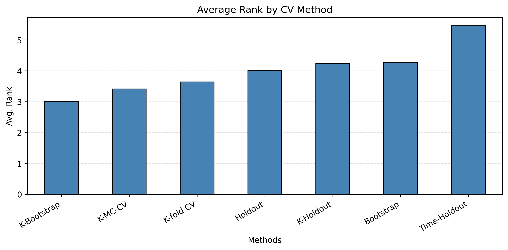

# Time Series Cross-Validation Benchmark for Global Forecasting Models

This repository benchmarks cross-validation (CV) strategies for **time series forecasting with global deep learning models**.

The main question is whether model validation should split only across time (standard forecasting practice) or also across series (possible in multi-series datasets). The implementation is built on a Nixtla-style workflow.

## Scope

The benchmark compares:

- **Time-wise CV** (split across time only)
- **Series-wise CV** (split across series), including:
  - K-fold
  - (Repeated) bootstrapping
  - Monte Carlo CV
  - (Repeated) holdout

Experiments evaluate CV procedures on three dimensions:

1. **Performance estimation**: how well CV estimates out-of-sample error
2. **Model selection quality**: how often CV picks the best configuration (accuracy and regret)
3. **Downstream forecasting performance**: final test performance (CV as part of the forecasting pipeline)

## Repository Layout

```text
experiments-tscv/
├── assets/results      # Saved CV outputs
├── src/                # Main source files, including...
├── src/cv              # ...the implementation of CV approaches
└── scripts/            # Scripts for running experiments
```

## Installation

```bash
git clone https://github.com/vcerqueira/experiments-tscv.git
cd experiments-tscv
pip install -r requirements.txt
```

## Running the Benchmark

1. Configure experiment settings (e.g. number of folds, training percentage, etc.) in `src/config.py`.
2. Run nested CV experiments:

```bash
python scripts/experiments/main_nestedcv.py
```

## Result Analysis

Use scripts in `scripts/experiments/analysis`:

- `estimation_scores.py`: performance estimation and model selection metrics (accuracy and regret)
- `results_aswf.py`: downstream forecasting results based on MASE

The image below shows the average rank of forecasting performance of each CV approach (lower is better).




## Contact

For questions or issues, please open a GitHub issue.
